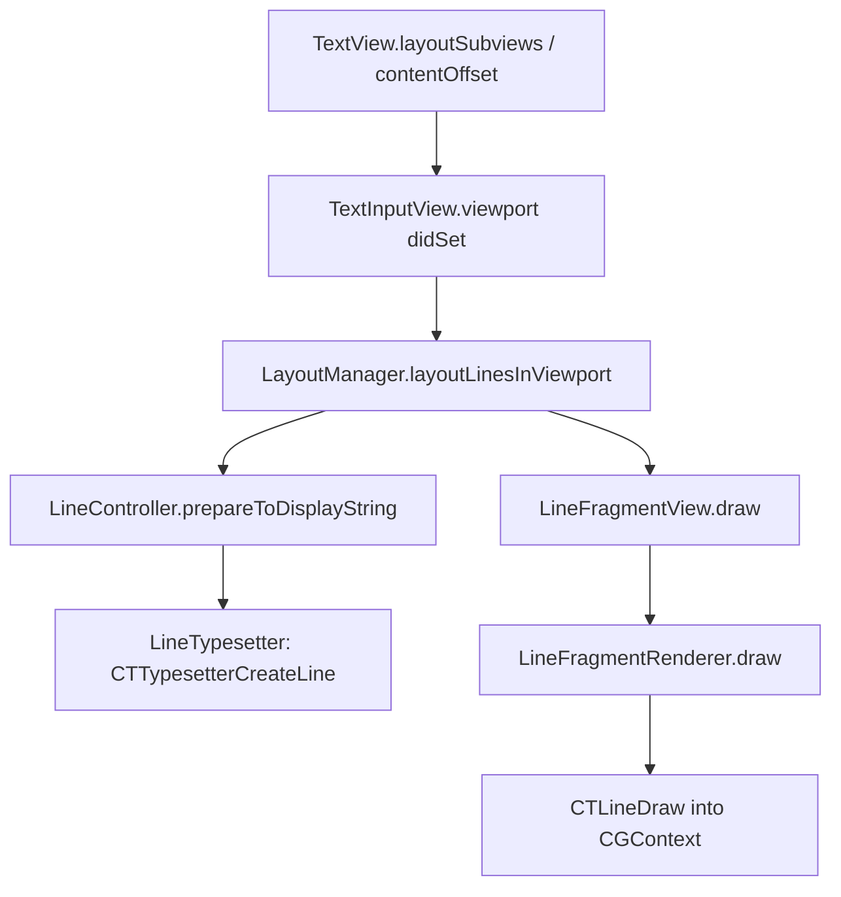
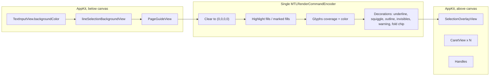

# Metal Rendering for Runestone

| Field | Value |
| --- | --- |
| **Author** | TBD |
| **Date** | 2026-09-05 |
| **Status** | Draft (open questions resolved 2026-09-05) |
| **Audience** | Runestone engine maintainers |
| **Scope** | `Sources/Runestone/TextView` drawing path only. No EIP, Tree-sitter, or storage changes. |

---

## Overview

Runestone paints every visible line fragment with a dedicated `NSView` (`LineFragmentView`) whose `draw(_:)` calls `CTLineDraw` into a Core Graphics context. Layout, typesetting, hit-testing, and IME already scale with the viewport — the red-black-tree `LineManager`, incremental `LineTypesetter`, and `ViewReuseQueue` are not the problem. The problem is the per-fragment view/layer tax: on a typical retina viewport Runestone currently owns ~80–150 layer-backed views, each CPU-rasterizing glyphs into its own backing store on every invalidation, then asking Core Animation to composite them.

This design introduces an opt-in Metal canvas that **replaces only the glyph-and-decoration paint** of those fragment views. Core Text remains the typesetter. `TextInputView` remains the first responder and `NSTextInputClient`. Gutter, minimap, caret, selection handles, page guide, find panel, and ghost text stay AppKit views.

The canvas is a **viewport-sized, non-opaque `CAMetalLayer` hosted inside `TextInputView`**, sandwiched between `lineSelectionBackgroundView` (and the page guide) below and the selection/caret/handles above. It is repositioned to the visible text rect on every layout (**view-follows-viewport**); the vertex shader subtracts only `canvas.frame.origin`. The layer clears to transparent so page-guide shading and the current-line fill show through.

The chosen glyph strategy is a **CTRun-driven coverage glyph atlas** (R8) with a small BGRA atlas for color glyphs (emoji). MSDF is rejected. Whole-`CTLine` texture caching is a rejected shipping design. A single-CG-canvas alternative (one view, still `CTLineDraw`) is the justification bar for why the atlas is worth it.

Metal is **off by default through PR 8**. Production default-on is PR 9, and only when a Metal device exists and the process is not under XCTest. A UserDefaults kill switch and a per-view property remain.

---

## Background & Motivation

### Current drawing path

The live paint path is entirely CPU / AppKit / Core Text / Core Graphics. There is no `Metal`, `MetalKit`, `CAMetalLayer`, or `MTLDevice` usage anywhere in the package.



Concrete types:

| Stage | Type | File |
| --- | --- | --- |
| Scroll / viewport | `TextView.contentOffset` forces `textInputView.layoutIfNeeded()` | `Sources/Runestone/TextView/Core/TextView.swift` (~349–363, 1030–1052) |
| Layout | `LayoutManager.layoutLinesInViewport()` | `Sources/Runestone/TextView/Core/LayoutManager.swift` (~488–590) |
| Typesetting | `LineTypesetter.makeLineFragment` → `CTTypesetterCreateLine` | `Sources/Runestone/TextView/LineController/LineTypesetter.swift` (~219–244) |
| Per-fragment view | `LineFragmentView.draw` | `Sources/Runestone/TextView/Core/LineFragmentView.swift` (~32–36) |
| Glyph paint | `LineFragmentRenderer.drawText` → `CTLineDraw` | `Sources/Runestone/TextView/LineController/LineFragmentRenderer.swift` (~285–293) |
| Decorations | highlights, marked text, invisibles, fold placeholder | same renderer |
| View reuse | `ViewReuseQueue<LineFragmentID, LineFragmentView>` | `Sources/Runestone/Library/ViewReuseQueue.swift` |
| Hit testing | `CTLineGetStringIndexForPosition` | `LineController.closestIndex(to:)` |

`LineFragmentView` sets `backgroundColor = .clear`. `UIView.backgroundColor`'s `didSet` (`Sources/Runestone/Library/UIKitCompatibility/UIView.swift`) turns on `wantsLayer = true`. Every visible fragment is therefore a layer-backed `NSView`. `layoutLineFragmentView` parents it under `linesContainerView`, which itself is a full-`contentSize` child of `TextInputView`.

### What already scales

These are **not** in scope for Metal, and must keep working unchanged:

- `LineManager` fat-leaf red-black tree: O(log n) line lookup, including folded (zero-height) lines.
- Viewport-scoped typesetting: `paddedInsetViewport` expands the visible rect by `verticalLayoutPadding = 350` pt so fragments are prepared before they scroll in (`LayoutManager.swift` ~163–172, 488–590).
- Incremental Tree-sitter highlighting on a background queue, then `LineController.redisplayLineFragments()` on the main actor.
- `ViewReuseQueue` recycling of fragment views and line-number labels.
- Piece-tree storage and EIP. `PERFORMANCE_AUDIT.md` Phase 1 §5 already states rendering is not a multi-GB bottleneck because it is viewport-scoped — Metal is about **frame time and typing latency**, not file size.

### Pain points Metal can actually fix

1. **Per-fragment `NSView` + `CALayer` overhead.** A 14" retina viewport at ~18 pt line height shows ~55 document lines; plus 350 pt padding above and below that is ~90–110 fragments, more with wrapping. Each is a layer with its own backing store. Fast scroll recycles many of them per tick (`ViewReuseQueue.enqueueViews` / `dequeueView`).
2. **CPU rasterization of already-typeset glyphs.** `CTLineDraw` re-rasterizes coverage into a CG bitmap every time `setNeedsDisplay()` fires — which happens on highlight changes, marked-text updates, focus-mode alpha, fold placeholders, and theme application (`LineFragmentController` setters all call `lineFragmentView?.setNeedsDisplay()`).
3. **Backing-store memory.** A 1400×18 pt fragment at 2× is ~400 KB of BGRA. 100 fragments ≈ 40 MB of CALayer backing stores, discarded and reallocated as views recycle. A glyph atlas for the same scene is a few megabytes of R8 plus an instance buffer.
4. **Scroll-wheel path is already synchronous.** `TextView.contentOffset` comments that wheel events skip AppKit's layout pass, so it **forces** `layoutIfNeeded()` on every offset change (`TextView.swift` ~357–361). That is the right behavior (otherwise "text disappears"), but it means the fragment-view commit happens on the 60/120 Hz hot path. Metal can rebuild an instance buffer instead of committing 100 layers.

The cheapest fix for (1) alone is Alternative F (one CG canvas view). Metal is justified only if we also cut the CPU raster in (2) and the backing-store memory in (3).

### Hierarchy that must not break

```
TextView (UIScrollView / NSView)
├─ FlippedClipView                          // UIScrollView.swift
│  └─ documentContainer
│     ├─ TextInputView                      // first responder, NSTextInputClient
│     │  ├─ lineSelectionBackgroundView
│     │  ├─ pageGuideController.guideView   // sendSubviewToBack when shown
│     │  ├─ linesContainerView              // LineFragmentViews live here today
│     │  ├─ selectionOverlayView            // SelectionOverlayController.install()
│     │  ├─ caretView + secondaryCaretViews
│     │  ├─ startHandle / endHandle
│     │  └─ FloatingCaretView (transient)
│     └─ gutterContainerView                // gutterParentView = TextView
│        ├─ gutterBackgroundView
│        ├─ gutterSelectionBackgroundView
│        ├─ lineNumbersContainerView        // LineNumberView reuse queue
│        └─ foldRibbonView                  // mouse hit-testing for folds
├─ minimapView          (addFixedOverlaySubview)
└─ findPanelController.panelView
```

`TextInputView` is the `NSTextInputClient` (`TextInputView+NSTextInputClient.swift`). Mouse hit-testing uses `LayoutManager.closestIndex(to:)` → `CTLineGetStringIndexForPosition`. Selection handles are `isUserInteractionEnabled = true` views. None of this can move onto a Metal layer that swallows hits.

The page guide is `sendSubviewToBack` (`TextInputView.swift` ~477–478) and is a viewport-tall view from the guide column to the trailing edge (`layoutPageGuideIfNeeded`, ~1470–1479). Today glyphs composite *on top of* that shading. The current-line fill is `lineSelectionBackgroundView`, added first in `LayoutManager.setupViewHierarchy` (~655–656). An opaque Metal clear would hide both.

---

## Goals & Non-Goals

### Goals

- 60 fps scroll of a 100k-line file on an Intel MacBook Pro (2019-class) at 2×; 120 fps on ProMotion Apple Silicon when the window's `maximumFramesPerSecond` is 120, without dropping to blank frames at the leading edge of a flick.
- Typing latency: glyph paint of the edited line ≤ 0.5 ms on Apple Silicon after the existing `LineTypesetter` work; no additional main-thread hitch from atlas misses of ASCII/Latin-1 in the active font.
- Memory: glyph atlas budget ≤ 32 MB per process (shared across workbench `TextView`s); no full-content-height Metal textures.
- Visual parity with the CG path for: kerning, ligatures (e.g. Fira Code), combining marks, emoji, italic/bold `FontTraits` (including synthetic traits via `UIFont.withSymbolicTraits`), `kern`, `lineHeightMultiplier`, HiDPI, dark/light, focus-mode dimming, diagnostic squiggles, find-match fills, marked text, fold placeholders, customizable invisible-character symbols.
- Feature flag + runtime fallback so the CG path remains correct and tested.
- Incremental PRs, each independently reviewable and mergeable. Metal is not default-on in any configuration that can be flipped on until run-level fallback and invalidation hooks exist.

### Non-Goals

- Replacing Core Text typesetting, `LineManager`, Tree-sitter, or `NSTextInputClient`.
- A GPU text layout engine, harfbuzz, or custom shaper.
- MSDF/SDF fonts, GPU glyph generation, or compute-based rasterization.
- Metalizing the gutter, minimap, find panel, completion panel, hover, breadcrumbs, or ghost text.
- Off-thread command-buffer encode in v1. Atlas miss raster + upload is main-thread (see § Glyph strategy). A background queue may **only** pre-warm CPU bitmaps.
- Subpixel (RGB) filtering and subpixel-X atlas buckets 1–3. Coverage + retina is enough. `GlyphKey.subpixel` is always 0 (integer raster, fractional quad position). Buckets 1–3 are **not** in the PR plan.
- Dedicated `NSShadow` instance path. `Theme.shadow(for:)` is applied in `TreeSitterSyntaxHighlighter.setAttributes` (~92–93). Default theme returns nil. If a run has `.shadow`, v1 uses the **run-level raster fallback** (bakes the shadow) rather than a shadow shader.
- RTL policy changes. If Core Text emits RTL runs we will draw them; we will not add BiDi policy that `LineController.closestIndex` does not already have.
- Windows/iOS. This is the macOS AppKit port.

---

## Proposed Design

### 1. CPU vs GPU split

**Stays on CPU (unchanged APIs):**

| Work | Why |
| --- | --- |
| `LineManager` lookups, fold hiding, content size | O(log n) data model; Metal does not care |
| `LineController.prepareToDisplayString` / syntax highlighting | Produces `NSAttributedString` + `CTLine` |
| `LineTypesetter` (`CTTypesetterCreateWithAttributedString`, `CTTypesetterSuggestLineBreak`, `CTTypesetterCreateLine`) | Only Core Text gets ligatures, kerning, emoji substitution, font fallback, and tab stops right |
| Caret/selection rects (`CaretRectService`, `SelectionRectService`, `CTLineGetOffsetForStringIndex`) | Needed for IME `firstRect(forCharacterRange:)`, mouse, handles |
| Hit testing (`CTLineGetStringIndexForPosition`) | Must match what was typeset, not what was drawn |
| Gutter, minimap, page guide, find panel, ghost text, handles | Interactive or already cheap; page guide and line-selection fills **show through** the transparent canvas |

**Moves to GPU:**

| Work | How |
| --- | --- |
| Glyph coverage | Sample R8 atlas; tint in fragment shader from the run's `NSForegroundColorAttributeName` |
| Color glyphs (emoji, some CJK presentation) | Sample BGRA atlas; already-premultiplied sample, alpha only |
| Fragment-local decorations currently in `LineFragmentRenderer` | Instanced quads / generated polylines: standard fills, underlines, squiggles, outlines, marked-text fill, warning borders, fold-chip background |
| Invisible symbols and fold-chip text | Tiny `CTLine`s rasterized into the same atlas, using the same fonts as the CG path (`theme.font` / `UIFont.systemFont(ofSize: 11, weight: .medium)`) |
| Focus-mode dimming | Per-span alpha on glyph instances (`unfocusedAlpha` / `focusedRanges`) instead of CG clip+`setAlpha` |

**Stays AppKit overlays (not drawn in Metal, v1):**

| View | Reason |
| --- | --- |
| `CaretView` / secondary carets | 1–N 2×18 pt layers, blink timer, `bringSubviewToFront`; cheaper as views; VoiceOver/IM cursor association |
| `SelectionOverlayView` | Sibling *above* glyphs (`SelectionOverlayController.install` adds it after `linesContainerView`). **Decided:** stays AppKit. No Metal selection/caret path in this design (not a committed v2 PR). |
| `SelectionHandleView` | Must receive mouse drags |
| `lineSelectionBackgroundView` / `gutterSelectionBackgroundView` | Simple `UIView.backgroundColor` fills, already layer-backed. Visible *through* the transparent canvas. Optional PR 10 may move the **line** fill (not gutter) into Metal with page-guide shading to recover opacity. |
| `PageGuideView` | Hairline + shading `UIView`s, `sendSubviewToBack`, non-interactive. Visible through the canvas. |
| `gutterContainerView` subtree | Line numbers (`UILabel`), fold ribbon mouse handling |
| `MinimapView` | Intentionally not glyphs (`MinimapView.swift` header); already viewport-bounded |
| `GhostTextView` | EIP overlay, not part of `LayoutManager` |
| Find panel, completion, hover, parameter hints | Hosted UI, not document paint |

### Glyph strategy (decision)

**Pick: CTRun-driven coverage glyph atlas + BGRA color-glyph atlas.**

We never reshape. We only draw the glyphs Core Text already decided — but that is not sufficient by itself. The extractor is a deterministic pipeline that reproduces the same baseline, matrix, and metrics `CTLineDraw` uses in `LineFragmentRenderer.drawText` (~285–293).

#### Extractor pipeline (`GlyphRunExtractor`)

Inputs: `CTLine`, fragment frame in content coordinates, `descent`, `baseSize`, `scaledSize`, `unfocusedAlpha`, `focusedRanges`, `effectiveAppearance`, scale.

1. **Baseline in fragment-local view coordinates** (Y down, matching `UIView.isFlipped`). `drawText` flips the CG context, then sets `textPosition.y = descent + (scaledSize.height - baseSize.height) / 2` measured from the fragment *bottom*. Equivalently, from the fragment *top*:

   ```
   paddingTop = (scaledSize.height - baseSize.height) / 2
   baselineY  = paddingTop + baseSize.height - descent
              = (scaledSize.height + baseSize.height) / 2 - descent
   ```

   This is the same vertical centering `LineController.caretRect` uses (`LineController.swift` ~427–428: caret top = `yPosition + paddingTop`, height = `baseSize.height`). If Metal misses this, carets will not sit on glyphs.

2. Walk `CTLineGetGlyphRuns(line)` (a `CFArray` of `CTRun`).

3. For each run:

   - `font = (CTRunGetAttributes(run)[.font] as CTFont) ?? theme.font`. Rasterize and measure with **that `CTFont` as-is**. `CTFontDrawGlyphs` and `CTFontGetBoundingRectsForGlyphs` already apply `CTFontGetMatrix` (this is how `UIFont.withSymbolicTraits` italic in `TreeSitterSyntaxHighlighter.swift` ~98–162 becomes a shear). Do **not** compose `CTFontGetMatrix` onto positions or bounds — that double-shears italic quads relative to the atlas tile.
   - `runMatrix = CTRunGetTextMatrix(run)`. Apply **only** this matrix to positions/bounds, and only when it is non-identity. `CTRunGetPositions` are line-relative and already include layout; they are not multiplied by `CTFontGetMatrix`. A non-identity `runMatrix` that we fail to reproduce is the `.hasNonIdentityMatrix` run-fallback trigger (step 7).
   - `color`: `NSForegroundColorAttributeName` resolved under `view.effectiveAppearance` via `NSAppearance.performAsCurrentDrawingAppearance`, else `theme.textColor`. Convert to premultiplied sRGB `SIMD4<Float>`.
   - `isColor` iff `CTFontCopyAttribute(font, kCTFontColorGlyphsAttribute)` is the true `CFBoolean`, **or** `CTFontGetSymbolicTraits(font)` contains `.colorGlyphs` (`CTFontSymbolicTraits.traitColorGlyphs`). One algorithm, not a disjunction of bbox heuristics. SBIX/CBDT/COLR/SVG all set that bit on Apple fonts. If neither is set, treat as coverage. If a later draw is clearly wrong (see run fallback), that run is rasterized as BGRA.
   - `CTRunGetGlyphs` + `CTRunGetPositions` (positions are already kerned, ligature-substituted, mark-positioned, relative to the line origin / baseline).
   - If the run has `NSShadowAttributeName`, skip per-glyph instancing and emit one **run-level fallback** quad (step 7).

4. For each coverage/color glyph:

   - Bounds = `CTFontGetBoundingRectsForGlyphs(font, .default, &glyph, &rect, 1)` (already in that `CTFont`’s matrix space), then transformed by `runMatrix` **only if** `runMatrix` is non-identity, plus **2 px pad** on each edge for AA. Never use the advance as the quad size (clips italics and combining marks).
   - Cap: if padded size exceeds 256×256 px, do not atlas it; the whole run takes the run-level fallback.
   - Atlas lookup with `GlyphKey` (below). On miss: rasterize on the **main actor** into a padded `CGBitmapContext` (`.alphaOnly` / R8 for coverage, `.premultipliedLast` BGRA for color) and `CTFontDrawGlyphs` at the glyph's origin inside the pad. Upload via `MTLTexture.replace` (or blit; see storage mode).
   - Quad in **content coordinates** (`runPosition` is `CTRunGetPositions` output, optionally `runMatrix`-transformed when non-identity; **not** font-matrix-transformed):

     ```
     glyphLeft = fragmentFrame.minX + runPosition.x + bounds.origin.x - pad
     glyphTop  = fragmentFrame.minY + baselineY - (bounds.origin.y + bounds.height) - pad
     ```

     (`bounds` is in Core Text’s Y-up, origin-at-baseline space.)
   - Apply focus-mode alpha: if the glyph’s string index (from `CTRunGetStringIndices`) is outside `focusedRanges` and `unfocusedAlpha < 1`, multiply `color.a` (and RGB, since premultiplied).

5. **Viewport cull vs atlas warm (two rects).** Instances are a function of the camera; atlas residency is not.

   - `emitRect = canvas.frame` inset by −2 px. Emit a `GlyphInstance` only if the padded quad intersects `emitRect`. This keeps a wrapping-off 50k-character line (`constrainingLineWidth = 10_000` in `LayoutManager.swift` ~123–126) at ~visible-width instances.
   - `atlasWarmRect` = `paddedInsetViewport` in the same content X as the canvas (Y expanded by `verticalLayoutPadding = 350` pt, X = visible text width, **not** the 10_000 pt line). Glyphs that miss `emitRect` but hit `atlasWarmRect` still `atlas.lookup` / rasterize; they emit **no** instance. That is how the pad pre-fills CJK/emoji before a vertical flick without bloating the instance buffer.

   **Cull rect is part of the instance cache key.** `GPUFragment` stores the `emitRect` used at last extract. A pan that changes `canvas.frame` **must re-extract instances** even when `CTLine` identity / `contentRevision` is unchanged (horizontal pan of one long fragment is the canonical case — reuse of the old cull set would freeze a strip of glyphs). Re-extract is the cheap part (~200 visible glyphs); skip only atlas raster on hits. Do not scissor 50k glyphs in the vertex shader as the primary approach.

6. **Per-frame miss cap:** at most **8** new glyph rasters on the main thread per present. Further misses in the **emit** band reuse the previous frame’s instance for that glyph key if one exists; otherwise they take the run-level fallback for the rest of that run. `atlasWarmRect` lookups share the same cap (visible-band rasters win).

7. **Run-level fallback (required before production default-on):** rasterize the entire `CTRun` with `CTFontDrawGlyphs` (or `CTLineDraw` of a one-run line) into a BGRA scratch quad, including shadow if present. Used for: color-font detection miss, glyph over size cap, `.shadow` attribute, per-frame raster cap overflow, or a non-identity `CTRunGetTextMatrix` that we fail to reproduce. This is not optional.

**Atlas key:**

```swift
struct GlyphKey: Hashable {
    var fontID: ObjectIdentifier   // ObjectIdentifier(CGFont) from CTFontCopyGraphicsFont
    var glyph: UInt16
    var pixelSize: UInt16          // round(pointSize * scale * 64)
    var matrixHash: UInt64         // hash of CTFontGetMatrix + quantized CTRunGetTextMatrix (6+6 affine components). Synthetic italic must miss the upright tile without double-applying the shear at draw time.
    var scale: UInt8               // 1 or 2 (or 3 on some displays)
    var subpixel: UInt8            // always 0 in this design; buckets 1–3 are not in the PR plan
    var isColor: Bool
}
```

Do **not** key by `CFHash(CGFont)` alone — synthetic italic is often the same `CGFont` with a sheared `CTFont` matrix.

Coverage glyphs live in one or more 2048×2048 `R8Unorm` pages. Color glyphs live in 1024×1024 `BGRA8Unorm` pages.

**Threading:** v1 `GlyphAtlas` is `@MainActor`. Lookup, raster, `replace`/blit, and cache insert all happen on the main thread. There is **no** `MTLSharedEvent` in v1. The only allowed background work is a serial queue `runestone.glyph-atlas.prewarm` that builds **CPU bitmaps** for Latin-1 of `theme.font` plus line-number digits; the main actor uploads and inserts them. Off-thread encode is v2.

**Storage mode:** pick from `device.hasUnifiedMemory`:

| Device | Atlas textures | Upload | Instance buffers |
| --- | --- | --- | --- |
| `hasUnifiedMemory == true` (Apple Silicon, Intel integrated) | `.storageModeShared` | `MTLTexture.replace` | `.storageModeShared` |
| `hasUnifiedMemory == false` (typical 2019 Intel + discrete AMD, which `MTLCreateSystemDefaultDevice()` often returns) | `.storageModePrivate` | Shared staging buffer → `MTLBlitCommandEncoder.copy` | `.storageModeShared` (CPU writes every frame; small) |

This is part of PR 2, not later hardening. Sampling a Shared atlas over PCIe on discrete GPUs would miss the 60 fps Intel target.

**Pre-warm:** when `theme.font` is applied, enqueue Latin-1 + `"0123456789"` at the current scale. Typing ASCII in the theme font should never miss.

**Why not whole-`CTLine` textures.** A cached raster of each fragment is the smallest code change (`CTLineDraw` into an `MTLTexture`) but color is baked (syntax/theme/focus re-raster), memory is ~40 MB BGRA per `TextView`, and there is no sharing across fragments. Acceptable as a spike, not as the shipping architecture.

**Why not MSDF.** A code editor uses 1–3 point sizes but many font variants. MSDF generation is slow, looks worse at the native size than a raster atlas, and cannot represent color emoji.

**Why not a compute-shader glyph rasterizer.** Out of scope; `CTFontDrawGlyphs` is the source of truth for Apple fonts, including SBIX/CBDT emoji.

### 2. Hosting `CAMetalLayer` in the existing AppKit hierarchy

Do **not** use `MTKView`. It brings MetalKit, owns its own display link, and fights AppKit layout.

This port’s `UIView` is `open class UIView: NSView` (`Sources/Runestone/Library/UIKitCompatibility/UIView.swift`) and does **not** define `layerClass`. AppKit’s hook is `makeBackingLayer()`. Do not add a fake `layerClass` to the UIKit shim.

**v1 pick: view-follows-viewport, transparent canvas, child of `TextInputView`.**

Rejected option 1 (fixed overlay of `TextView` via `addFixedOverlaySubview`, shader subtracts `contentOffset`) is internally consistent but covers caret/handles/page guide unless those views are also promoted. It is not the v1 path. Do not implement it.

```
TextInputView  (first responder, NSTextInputClient, hit testing)
├─ lineSelectionBackgroundView          // below canvas; shows through
├─ pageGuideController.guideView        // sendSubviewToBack; shows through
├─ MetalTextCanvasView                  // NEW, transparent, hitTest → nil
├─ linesContainerView                   // empty when Metal is active
├─ selectionOverlayView
├─ caretView + secondaryCaretViews
└─ startHandle / endHandle
```

Z-order by PR:

| PR | Canvas position | Who paints glyphs |
| --- | --- | --- |
| PR 1 | Child of `TextInputView`, **behind** `linesContainerView` (insert below it). Hidden unless the flag is on. Clears transparent. | Still `LineFragmentView`s (z-order check: fragments on top of an empty/transparent canvas) |
| PR 4+ | Same parent, **in front of** `linesContainerView` and **behind** `selectionOverlayView`. `linesContainerView` has no fragment subviews when Metal is active. | Metal |

`MetalTextCanvasView` (`Sources/Runestone/TextView/Metal/MetalTextCanvasView.swift`):

- Subclass of `UIView` (flipped `NSView`).
- `wantsLayer = true`.
- `override func makeBackingLayer() -> CALayer` returns a configured `CAMetalLayer`.
- `layerContentsRedrawPolicy = .onSetNeedsDisplay`. Do not set `wantsUpdateLayer` (we encode a command buffer in `draw(_:)`).
- `isUserInteractionEnabled = false`.
- `override func hitTest(_ point: NSPoint) -> NSView? { nil }`.
- `setAccessibilityElement(false)` and `setAccessibilityHidden(true)` in `init` (AppKit; there is no `accessibilityElement` property on this `NSView`).
- Frame, set from `LayoutManager.layoutIfNeeded` / `layoutLinesInViewport` every time `viewport` changes — **including horizontal pan**. Gutter already uses `x: viewport.minX` (`layoutGutter`, ~394) to stay stuck to the visible left edge; the canvas must do the same or an unwrapped line (`constrainingLineWidth = 10_000`) slides the layer with the document.

```swift
// View-follows-viewport. Shader subtracts ONLY this origin.
metalCanvas.frame = CGRect(
    x: viewport.minX + leadingLineSpacing,
    y: viewport.minY,
    width: max(viewport.width - leadingLineSpacing - minimapWidth, 0),
    height: viewport.height
)
```

Find-panel height is a `TextView`-level fixed overlay and does not inset this frame (the clip view already ends above it). Minimap width **does** inset, matching `TextView.layoutSubviews` reserving `minimapWidth` from `scrollViewWidth`.

- `CAMetalLayer` configuration (macOS 12-safe):

```swift
metalLayer.device = MetalContext.shared.device
metalLayer.pixelFormat = .bgra8Unorm
metalLayer.framebufferOnly = true
metalLayer.contentsScale = window?.backingScaleFactor ?? NSScreen.main?.backingScaleFactor ?? 2
metalLayer.drawableSize = CGSize(
    width: bounds.width * metalLayer.contentsScale,
    height: bounds.height * metalLayer.contentsScale
)
metalLayer.colorspace = CGColorSpace(name: CGColorSpace.sRGB)
metalLayer.isOpaque = false          // v1: page guide + line selection show through
metalLayer.presentsWithTransaction = true  // commit with the CA transaction that moves carets
```

Clear color is `(0, 0, 0, 0)`, not `textBackgroundColor`. `TextInputView.backgroundColor` (set from `TextView.backgroundColor`) remains the editor background.

**Present path (do not `nextDrawable` from layout):**

`TextView.contentOffset` already forces `layoutIfNeeded()` on every wheel delta (`TextView.swift` ~357–361). `LayoutManager.layoutIfNeeded` wraps work in `CATransaction.setDisableActions(true)` (~366–372). Calling `nextDrawable()` there presents more than vsync on a flick and blocks (drawable pool, up to ~1 s) — worse than today’s CG path.

Rules:

1. `LinePaintBackend` / `LayoutManager` **never** call `nextDrawable()`. They update CPU instance data and call `metalCanvas.setNeedsDisplay()`.
2. `MetalTextCanvasView.draw(_:)` (AppKit display pass, coalesced) is the only place that acquires a drawable, encodes, `present`, and `commit`.
3. Guard: `window != nil`, `!isHidden`, `drawableSize.width > 0 && drawableSize.height > 0`, and a `dirty` flag so a spurious `draw` is a no-op.
4. `presentsWithTransaction = true` so the drawable commits with the CA transaction that also moves carets/selection (`TextInputView.layoutSubviews` calls `selectionOverlayController.updateLayout()` after `layoutManager.layoutIfNeeded()`, ~947–953).
5. Present **after** `LayoutManager`’s inner `CATransaction.commit()` returns — which is automatic if we only `setNeedsDisplay` during that transaction and let AppKit display later in the pass.
6. Off-screen: `viewDidMoveToWindow` and `draw` both no-op when `window == nil`. `EditorHostCache` does not need a hook; any cached/hidden `TextView` is handled here.

**What this does not break:**

| Concern | Why it still works |
| --- | --- |
| `NSTextInputClient` | Still `TextInputView`; Metal view is not in the responder chain |
| First responder | `TextView.becomeFirstResponder` already forwards to `textInputView` |
| Mouse hit-testing | Canvas returns `nil` from `hitTest`; `TextInputView+MouseKeyboard` and `LayoutManager.closestIndex(to:)` unchanged |
| Selection handles / caret | Siblings **above** the canvas; not covered |
| Page guide / line-selection fill | Siblings **below** a transparent canvas; show through |
| IME candidate window | `firstRect(forCharacterRange:)` uses CPU caret rects converted to screen space |
| Accessibility | Canvas is excluded from the AX hierarchy; hit-testing stays on `TextInputView` |

`linesContainerView` stays in the hierarchy for the CG fallback; when Metal is on it has no fragment subviews.

### 3. Scene graph and render passes

One render pass, several instanced draws into the same drawable. Clear is **transparent**; AppKit below the canvas provides background, line-selection fill, and page guide.



**Blend** (`MTLRenderPipelineColorAttachmentDescriptor` on every pipeline that writes color):

```
isBlendingEnabled = true
rgbBlendOperation = .add
alphaBlendOperation = .add
sourceRGBBlendFactor = .one                  // premultiplied
destinationRGBBlendFactor = .oneMinusSourceAlpha
sourceAlphaBlendFactor = .one
destinationAlphaBlendFactor = .oneMinusSourceAlpha
```

Coverage fragment: `out = SIMD4(color.rgb * coverage, color.a * coverage)` where `coverage = sample.r` of the R8 atlas and `color` is already premultiplied sRGB (focus alpha included). Color-glyph fragment: sample BGRA from `CTFontDrawGlyphs` into a `.premultipliedLast` bitmap; treat as premultiplied. If a snapshot shows dark fringes, premultiply in the rasterizer (`rgb *= a`) — verify in PR 2’s emoji readback test, do not guess in the shader.

Shaders are a Swift `StaticString` on `MetalContext`, compiled once via `device.makeLibrary(source:options:)` and cached on the context. **Do not add a `.metal` file under `Sources/Runestone/`** — SPM would treat it as an unhandled source (`Package.swift` currently `resources: [.copy("PrivacyInfo.xcprivacy"), .process("TextView/Appearance/Theme.xcassets")]`). 10–20 ms once per process is acceptable versus typesetting a file; time it in PerfHarness, do not gate CI on it.

- `text_vertex` / `text_fragment`: per-instance `GlyphInstance`. Coverage path as above.
- `color_glyph_fragment`: sample BGRA, output the sample (premultiplied), multiply alpha by instance alpha (focus dim).
- `solid_vertex` / `solid_fragment`: axis-aligned quads for fills (highlights, marked, fold chip background).
- `line_vertex` / `line_fragment`: polyline strips for underlines and squiggles. Squiggle control points are generated on CPU exactly as `LineFragmentRenderer.drawLineHighlight` (amplitude 1.5, wavelength 4) so snapshots match.

**Scrolling (view-follows-viewport):** instance positions are in **content coordinates** (the same space as `lineFragmentView.frame`: `x = leadingLineSpacing`, `y = textContainerInset.top + line.yPosition + fragment.yPosition`, see `layoutLineFragmentView`). The canvas has already been moved to `(viewport.minX + leadingLineSpacing, viewport.minY)`. The vertex shader subtracts **only** `canvas.frame.origin`:

```
x_ndc = (x - canvasOriginX) / canvasWidth  * 2 - 1
y_ndc = 1 - (y - canvasOriginY) / canvasHeight * 2
```

Y is flipped because Metal NDC is Y-up while `UIView.isFlipped == true`. Do **not** also subtract `viewport.origin` / `contentOffset` — that double-translates Y and mishandles horizontal pan.

Uniforms are `canvasOrigin`, `canvasSize`, `scale`. No atlas re-upload on scroll when keys hit. The instance buffer **is** rewritten on pan: `emitRect` is part of `GPUFragment`’s cache key (Glyph strategy step 5). `contentRevision` (CTLine identity) skips *atlas raster* and *CTRun walking of unchanged glyph IDs*, not instance rebuild. A horizontal pan of a wrapping-off line with unchanged `LineFragmentID` still re-culls ~visible-width glyphs against the new `canvas.frame`. A vertical pan re-culls and, for fragments that remain tracked, atlas-warms the new `atlasWarmRect` without emitting off-screen instances.

Unit tests (`MetalProjectionTests`): vertical pan (`contentOffset.y > 0`), horizontal pan (`contentOffset.x > 0`, wrapping off), both at 1× and 2×, with a non-zero gutter. A glyph at content `(leadingLineSpacing + 10, y)` must land at the same NDC as a CG `LineFragmentView` at that frame.

**Partial invalidation on edit:**

```mermaid
sequenceDiagram
  participant TIV as TextInputView.replaceText
  participant LC as LineController
  participant LT as LineTypesetter
  participant GR as GlyphRunExtractor
  participant AT as GlyphAtlas
  participant MR as MetalRenderer

  TIV->>LC: invalidateEverything()
  LC->>LT: reset + CTTypesetterCreateLine
  LT-->>LC: new LineFragment (new CTLine, same LineFragmentID scheme)
  Note over LC,MR: LineFragmentID is "\(lineId)[\(index)]"; edit of line L drops all GPU records for L
  LC->>GR: extract runs from new CTLine
  GR->>AT: lookup / rasterize misses on main
  GR-->>MR: replace instances for those LineFragmentIDs
  MR->>MR: setNeedsDisplay on canvas
```

**Display-only invalidation** (no `layoutLinesInViewport`):

- Invisible-character toggles/symbols call only `layoutManager.setNeedsDisplayOnLines()` (`TextInputView.swift` ~237–360) → today `lineFragmentView?.setNeedsDisplay()` (`LineController.swift` ~178–181).
- `LayoutManager.markedRange` didSet → `updateMarkedTextOnVisibleLines` → controller `markedRange` didSet → `setNeedsDisplay()` (no layout). `unmarkText` takes this path.

The Metal backend does **not** own `LineFragmentController` / `InvisibleCharacterConfiguration` / marked range. An `invalidateDecorations(forLineIDs:)` that only takes IDs cannot rebuild a marked fill after `unmarkText` — the stored `LineFragmentPaintSpec` would be stale.

**Display-only invalidation is a LayoutManager walk + `upsertFragment` with a fresh spec.** `setNeedsDisplayOnLines` and `updateMarkedTextOnVisibleLines` (PR 4) iterate `visibleLineIDs`, build a new `LineFragmentPaintSpec` from each visible `LineFragmentController` (current `CTLine`, current `LineFragmentDecorations` including `markedRange` and invisible-symbol config), and call `paintBackend.upsertFragment`. `MetalRenderer.upsertFragment` then:

- re-extracts glyphs only if `ObjectIdentifier(spec.line)` changed **or** `emitRect` (`canvas.frame`) changed;
- **always** rebuilds decoration instances from `spec.decorations`.

There is no ID-only decoration invalidate on the protocol. Highlight/diagnostic/focus changes already `setNeedsLayout` (`emphasisManager.onEmphasesChanged`, `TextInputView.swift` ~876–881; focus mode ~220–222), so a full upsert on layout is correct for those; PR 6 is then a *partial* rebuild optimization (skip the CTRun walk when both `CTLine` identity and `emitRect` match), not the correctness split.

**Full viewport redraw** is used for: theme change, font change, `lineHeightMultiplier`/`kern`/`tabWidth`/`lineBreakMode`, backing-scale change, live resize (projection + drawableSize), and the first frame after enabling Metal.

### 4. Synchronization with `LineManager` / `LineController`

Keep `layoutLinesInViewport` as the source of truth for *which* fragments exist and *where* they sit. Metal is a paint backend, not a layout backend.

When Metal is enabled, `layoutLineFragmentView` does **not** dequeue a `LineFragmentView`. Instead:

```swift
// LayoutManager.layoutLineFragmentView — Metal branch
let origin = CGPoint(
    x: leadingLineSpacing,
    y: textContainerInset.top + lineYPosition + lineFragment.yPosition
)
let size = CGSize(
    width: contentSizeService.contentWidth - leadingLineSpacing - textContainerInset.right,
    height: lineFragment.scaledSize.height
)
paintBackend.upsertFragment(LineFragmentPaintSpec(
    id: lineFragment.id,
    lineID: line.id,
    frame: CGRect(origin: origin, size: size),
    line: lineFragment.line,
    descent: lineFragment.descent,
    baseSize: lineFragment.baseSize,
    scaledSize: lineFragment.scaledSize,
    decorations: LineFragmentDecorations(
        highlighted: lineFragmentController.highlightedRangeFragments,
        markedRange: lineFragmentController.markedRange,
        markedColor: lineFragmentController.markedTextBackgroundColor,
        markedRadius: lineFragmentController.markedTextBackgroundCornerRadius,
        unfocusedAlpha: lineFragmentController.unfocusedAlpha,
        focusedRanges: lineFragmentController.focusedRanges,
        foldPlaceholder: lineFragmentController.foldPlaceholderText,
        foldPlaceholderColor: lineFragmentController.foldPlaceholderColor,
        foldPlaceholderBackgroundColor: lineFragmentController.foldPlaceholderBackgroundColor
    )
))
```

`LineFragmentDecorations` **must** carry fold colors. Today `LayoutManager` only sets `foldPlaceholderText` (~546–548); `foldPlaceholderColor` / `foldPlaceholderBackgroundColor` stay `LineFragmentRenderer` defaults (`.secondaryLabelColor` / `.quaternaryLabelColor`). Thread them through the controller so Metal and CG stay in sync.

`MetalRenderer` holds:

```swift
struct GPUFragment {
    let id: LineFragmentID
    var frame: CGRect
    var emitRect: CGRect             // canvas.frame used at last glyph extract; pan key
    var ctLineID: ObjectIdentifier   // identity of the CTLine last extracted
    var glyphRange: Range<Int>       // into glyph instance buffer
    var decorationRange: Range<Int>  // into decoration instance buffer
}
var fragments: [LineFragmentID: GPUFragment]
```

`upsertFragment` rebuilds glyph instances when `ctLineID` **or** `emitRect` differs from the last spec; it always rebuilds decorations from `spec.decorations`. Atlas raster runs only on `GlyphKey` misses.

**Eviction of GPU fragments** is driven from `appearedLineFragmentIDs`, which `layoutLinesInViewport` already computes (~508, 539, 576). Do **not** use `Set(lineFragmentViewReuseQueue.visibleViews.keys)` (~496, 578–584) as the source of “old visible” when Metal is active: if Metal never dequeues views, `visibleViews` is empty, `disappearedLineFragmentIDs` is empty, and `removeFragments` never runs. PR 4 changes this:

```swift
let oldVisibleLineFragmentIDs = paintBackend.trackedFragmentIDs  // not the reuse queue
// ... walk, fill appearedLineFragmentIDs ...
paintBackend.removeFragments(ids: oldVisibleLineFragmentIDs.subtracting(appearedLineFragmentIDs))
```

The CG backend’s `trackedFragmentIDs` can still be the reuse-queue keys.

Atlas glyphs are **not** evicted on scroll. Atlas eviction:

1. LRU at 32 MB, checked on **every upload** (the cap is the real signal).
2. `DispatchSource.makeMemoryPressureSource(eventMask: [.warning, .critical])` installed in `MetalContext` drops non-hot pages. This is the macOS signal.
3. Do **not** claim `UIApplication.didReceiveMemoryWarningNotification` is a macOS path. It is a compat string in `PlatformServices.swift` (~23–25); nothing in the package posts it, and the system will not.

Reuse: `LineFragmentID` is stable for a given line id + fragment index (`LineFragment.swift`). An in-place typeset of the same line (async syntax highlight completing) produces a new `CTLine` with the same IDs; `LineFragmentController.lineFragment` `didSet` already detects identity change. Metal treats a new `CTLine` object as a glyph rebuild (`ctLineID` mismatch). A pan with the same `CTLine` still rebuilds instances because `emitRect` changed. Decoration-only updates (marked text, invisibles) go through a fresh `upsertFragment` from LayoutManager; glyph extract is skipped when both `ctLineID` and `emitRect` match.

Dirty rects vs full viewport: `CAMetalLayer` presents a full drawable. We always encode the whole *visible-and-not-culled* instance range. There is no CG dirty-rect.

`verticalLayoutPadding = 350` is kept so newly revealed lines are **typeset** and their glyphs are **atlas-warmed** (lookup against `atlasWarmRect`) before they hit the screen. They do not occupy instance slots until they intersect `emitRect`. Atlas misses for the pad share the per-frame raster cap with the visible band (visible wins).

### 5. Retina, color, theme, resize, multiple `TextView`s

| Event | Action |
| --- | --- |
| `viewDidChangeBackingProperties` / window move between 1× and 2× | Set `metalLayer.contentsScale` and `drawableSize`; drop **all** atlas pages (keys include scale); full fragment rebuild |
| `viewDidChangeEffectiveAppearance` | Do **not** drop coverage glyphs. Re-resolve every instance color from the current `Theme` / attributed string (dynamic `NSColor`s must be converted with the view's `effectiveAppearance` via `NSAppearance.performAsCurrentDrawingAppearance`). Matches `UIView.viewDidChangeEffectiveAppearance` re-baking `backgroundColor`. |
| Theme / font assignment | `LayoutManager.theme` already invalidates highlighting and `setNeedsLayout()`. Additionally: if `theme.font` changed, `GlyphAtlas.invalidate(for: font)`; if only colors changed, rebuild instance colors |
| Live resize | `drawableSize` follows bounds; projection uses new canvas size; no atlas drop. Wrapping already invalidated by `scrollViewWidth` didSet (`TextInputView.swift` ~584–598) |
| `kern` / `lineHeightMultiplier` / tab width | Existing `invalidateLines()` path; new `CTLine`s; glyph rebuild for visible fragments. Atlas stays (same glyphs, new positions) unless the font matrix changed |
| Workbench splits / up to 8 live `TextView`s (`EditorHostCache` default) | One process-wide `MetalContext` (`MTLDevice`, `MTLCommandQueue`, shader library, `GlyphAtlas`). Each `TextView` has its own `CAMetalLayer`, instance buffers (triple-buffered, grow-by-doubling), and `GPUFragment` map. Off-screen hosts skip `nextDrawable` via `window == nil \|\| isHidden \|\| drawableSize == 0` in `MetalTextCanvasView` and **shrink instance buffers back to the 16k start size** — **no `EditorHostCache` API change** |
| Color space | sRGB layer, matching current CG default. Theme `UIColor`s converted with `cgColor` under the view's appearance. No Display P3 in v1 (avoids a CG-vs-Metal mismatch) |

`UIScreen.main.scale` today is `NSScreen.main?.backingScaleFactor ?? 2` (`PlatformServices.swift`). Metal must use **the window's screen**, not `NSScreen.main`, or a window on a 1× display would upload 2× glyphs and look wrong.

### 6. Fallback

```swift
// Sources/Runestone/TextView/Core/TextView.swift
extension TextView {
    /// Host-controlled preference. Default `false` under XCTest and in PRs 1–8;
    /// `true` in production after PR 9. Ignored when no Metal device exists.
    /// A `false` value always wins over `UserDefaults` `true` (per-view disable).
    public var isMetalRenderingEnabled: Bool { get set }

    /// `true` when this instance is currently painting via Metal.
    public var isMetalRenderingActive: Bool { get }
}

enum MetalActivation {
    static let defaultsKey = "RunestoneMetalRendering"

    /// Single resolution function. Call from `TextView` init and on flag/defaults change.
    static func resolved(
        property: Bool,
        deviceAvailable: Bool,
        defaults: Bool?  // UserDefaults.object(forKey:) as? Bool
    ) -> Bool {
        guard deviceAvailable else { return false }
        if defaults == false { return false }   // process-wide kill switch
        if property == false { return false }   // per-view disable beats QA force-on
        if defaults == true { return true }     // QA force-on (only if property is also true)
        return property
    }
}
```

| defaults | property | device | result | purpose |
| --- | --- | --- | --- | --- |
| `false` | `*` | `*` | off | process-wide kill switch |
| `true` | `false` | `*` | off | embedder per-view disable wins |
| `true` | `true` | yes | on | QA force-on |
| absent | `true` | yes | on | production after PR 9 |
| absent | `false` | `*` | off | XCTest, and PRs 1–8 default |

QA during PRs 1–8 enables Metal with the MacExample menu (`isMetalRenderingEnabled = true`), not with UserDefaults. `RunestoneMetalRendering=true` cannot override a false property.

`LayoutManager` keeps **both** backends compiled. The CG path is not `#if`'d out. Switching the flag at runtime:

- Metal → CG: hide canvas; next `layoutLinesInViewport` dequeues `LineFragmentView`s as today.
- CG → Metal: enqueue all fragment views; show canvas; full upsert of visible fragments.

`isMetalRenderingActive` is `resolved(...)` after the last evaluation.

### 7. Feature-by-feature interaction

| Feature | Metal v1 | Notes |
| --- | --- | --- |
| Multi-cursor carets | AppKit `CaretView`s | **Decided:** stay AppKit. `SelectionOverlayController.updateCarets` unchanged. No Metal caret path in this design |
| Column/block selection | AppKit `SelectionOverlayView` | **Decided:** stay AppKit. Rects from `SelectionRectService`. No Metal selection path in this design (not a committed v2 PR) |
| Tree-sitter + LSP semantic tokens | CPU attributed string | Colors land in `CTRun` attributes → glyph instance color. Shadows → run-level fallback |
| `EmphasisManager` (search, brackets) | Metal decorations | Same `HighlightedRangeFragment` data `layoutLinesInViewport` already stamps on the controller |
| Diagnostic squiggles | Metal polyline | Port of `drawLineHighlight(..., wavy: true)` |
| Code folding | Layout stays CPU (zero-height lines); Metal draws chip on header fragment | Placeholder **text** is a tiny `CTLine` with `UIFont.systemFont(ofSize: 11, weight: .medium)` (`LineFragmentRenderer.swift` ~247–273), not an atlas `'⋯'` of `theme.font`. Colors live on `LineFragmentDecorations` |
| Invisible characters | Metal | Arbitrary `String`s (`tabSymbol`, `spaceSymbol`, …) drawn as tiny `CTLine`s with `invisibleCharacterConfiguration.font` (theme font), matching `symbol.draw(in:withAttributes:)`. Not a hardcoded `·`/`▸`/`¬` glyph |
| Page guide | AppKit, **shows through** | v1 unchanged. Optional PR 10 may draw shading/hairline in Metal so the canvas can become opaque |
| Minimap | AppKit | **Decided:** not Metalized. Bar representation stays AppKit unless the minimap starts drawing real glyphs (out of this design) |
| Find-panel highlights | Metal decorations | Via `HighlightService` |
| Ghost text | AppKit `GhostTextView` | EIP; drawn at caret with `NSFont.systemFont` |
| IME / marked text | Metal fill + CPU caret | `markedRange` already per-fragment; `setNeedsDisplayOnLines` / marked didSet must dirty Metal in PR 4; candidate window uses `firstRect` |
| Accessibility | CPU | No `NSAccessibility` on `TextView` today. Canvas calls `setAccessibilityElement(false)` + `setAccessibilityHidden(true)`. Hit-testing stays on `TextInputView` |
| HiDPI | Atlas keyed by scale | See §5 |
| Dark/light | Recolor instances | See §5 |
| `kern` / line height | CPU typesetter | New positions, same atlas |
| Character pairs | Input-time, not paint | Unchanged |
| Indent guides | **Do not exist** (grep empty) | Out of scope; if added, they are decoration quads |
| Focus mode | Per-glyph alpha | Replaces CG clip spans in `drawGlyphs(to:clippedTo:alpha:)` |
| Distraction-free chrome | Unchanged | Operates on gutter/minimap alpha, not glyphs |
| Typewriter scrolling | Unchanged | Uses `lineAnchorY` / caret rects |
| `Theme.shadow(for:)` | Run-level fallback | Not a shader |

### 8. Performance targets

Grounded in the current architecture (one layer-backed `NSView` per visible fragment, `CTLineDraw` on `setNeedsDisplay`, forced `layoutIfNeeded` on every `contentOffset` change).

**Scene size (typical):**

- Viewport 1440×900 pt, 2×, Menlo 13 / ~18 pt line height → ~50 visible rows.
- `verticalLayoutPadding = 350` → ~40 extra rows. **~90 fragments.**
- Wrapped UI-heavy file: 1.5–2× fragments. Budget for **200 fragments**.
- Glyphs after viewport cull: ~200 fragments × ~180 glyphs/visible-width ≈ 36k worst typical, **not** 200 × 80. The 16k figure is a starting buffer size, not a cap.

**Long unwrapped lines:** with wrapping off, `constrainingLineWidth` is 10_000 pt (`LayoutManager.swift` ~123–126). A minified one-liner is **one** fragment with tens of thousands of glyphs. Viewport culling (extractor step 5) keeps instances proportional to **visible width**, not line length. PerfHarness case: wrapping-off 50k-character line.

**Instance buffers:** per `TextView`, start at 16k `GlyphInstance`s (~1 KB…1 MB depending on alignment), **grow by doubling** up to **128k** (~8 MB per buffer). If a present would exceed 128k after culling, split into multiple `drawPrimitives` calls over the same pipeline (sub-ranges of the buffer), still one command buffer. Do not silently drop glyphs. Triple-buffer (`frameIndex % 3`); CPU writes only the buffer not in flight. When `viewDidMoveToWindow` sees `window == nil` or the view is hidden, **shrink back to the 16k start size** so `EditorHostCache`’s 8 hosts do not keep 24 MB each.

**CPU today (order-of-magnitude, Apple Silicon):**

| Step | Estimate |
| --- | --- |
| `layoutLinesInViewport` walk + reuse queue | 0.3–1.0 ms (already signposted) |
| `CTLineDraw` × 90 into layer backing stores | 1–4 ms (depends on line length / fallback fonts) |
| CA commit of 90 layers | 1–3 ms |
| **Total paint** | **2–8 ms**, which fits 60 Hz and misses 120 Hz under wrapping + highlights |

**CPU + GPU target:**

| Step | Target |
| --- | --- |
| Same layout walk | unchanged (still required to typeset new lines) |
| Glyph extract of a newly visible fragment | < 50 µs (CTRun walks are cheap); long culled lines < 200 µs |
| Atlas hit (steady scroll of a warm file) | 0 |
| Atlas miss (unseen CJK / emoji) | < 200 µs raster + upload on main, ≤8 per frame |
| Instance buffer rewrite | < 0.2 ms at 16k; < 0.8 ms at 128k |
| GPU encode + present | < 0.5 ms |
| **Paint excluding typesetting** | **< 1 ms** typical; long-line first visit may exceed while filling the atlas cap |

**Scroll 100k-line file:** typesetting of a never-visited line is the remaining cost (`LineController.prepareToDisplayString`). Metal does not fix that. It does fix the *paint* of already-typeset lines, which is the current per-frame cost once the user is paging through a previously laid-out region. The 350 pt pad plus `stringView.prefetch` (`layoutLinesInViewport` ~505) already exist to hide typesetting. Present coalescing (Issue 6) is what keeps flicks from stalling on `nextDrawable`.

**Typing:** today, `replaceText` → invalidate that line → typeset → `setNeedsDisplay` on its fragment views → `CTLineDraw`. After Metal: same typeset, then replace the culled glyph instances for that line. Target: paint side < 0.5 ms when Latin-1 is warm. End-to-end typing latency remains dominated by Tree-sitter / EIP snapshots (`PERFORMANCE_AUDIT.md` Phase 1 §10), which this project does not touch.

**Memory:**

`GlyphInstance` is ~52–64 bytes. 128k × 64 B = 8 MB **per buffer**; ×3 in-flight = **~24 MB per busy TextView**. That does **not** fit in a 32 MB process cap that also holds 24 MB of atlas pages. Split the budgets:

| Resource | Budget |
| --- | --- |
| Coverage atlas | 4 pages × 2048×2048 R8 = 16 MB |
| Color atlas | 2 pages × 1024×1024 BGRA = 8 MB |
| **Atlas process cap** | **≤ 32 MB** (LRU on every upload). This cap is **atlas only**. |
| Instance buffers, typical | 16k start × 3 frames × on-screen `TextView`s ≈ 3–6 MB |
| Instance buffers, worst case | one on-screen view at 128k × 3 ≈ 24 MB extra; off-screen cached hosts are shrunk to 16k |
| Shader library, pipelines | < 1 MB |
| Current CALayer backing (for comparison) | ~40 MB **per TextView** at 2× |

Do not lower the 128k overflow valve: a 200-fragment × ~180 glyph viewport is already ~36k, and a wrapping-off pan plus pad can spike higher. Bound instance RAM by **on-screen views × 3 × current capacity**, not by `EditorHostCache.maxEntries`.

**Battery:** one **transparent** Metal layer that presents only when dirty (text change, scroll, decoration). Caret is *not* Metal, so blink does not redraw Metal. No `CVDisplayLink` / `MTKView` display loop. `setNeedsDisplay` + AppKit display pass only.

### 9. Testing strategy

| Layer | What | Where |
| --- | --- | --- |
| Unit | `GlyphRunExtractor` vs a known `CTLine`: glyph count, first/last positions equal `CTLineGetOffsetForStringIndex` for ASCII; baseline Y matches `paddingTop + baseSize.height - descent`; ligature via **Hoefler Text** (`NSFont(name: "HoeflerText-Regular", size:)` + `kCTLigatureAttributeName = 2`) — skip *that one test* only if the system face is nil (should not happen on macOS 12); combining mark `"e\u{0301}"` produces ≥2 glyphs; emoji ZWJ requires **Apple Color Emoji** by name (`isColor == true`); italic `withSymbolicTraits` vs regular asserts quad width is larger by **roughly the shear, not ~shear²** (guards double-applied `CTFontGetMatrix`) and a different `matrixHash` | `Tests/RunestoneTests/GlyphRunExtractorTests.swift` |
| Unit | `GlyphAtlas`: miss → raster → hit; eviction at 32 MB; scale-key isolation; color vs coverage routing; `hasUnifiedMemory` storage-mode branch (mockable device flag) | `GlyphAtlasTests.swift` |
| Unit | `MetalProjection`: content-space quad → NDC at 1× and 2×, flipped Y, **non-zero gutter, vertical pan, horizontal pan**. Wrapping-off long line: `emitRect` change rebuilds instances with unchanged `ctLineID` | `MetalProjectionTests.swift` |
| Unit | Decoration conversion: `HighlightedRangeFragment` `.standard`/`.squiggle`/`.underline`/`.outline` produce the same start/end X as `CTLineGetOffsetForStringIndex`; fold chip uses system 11 pt medium, not theme font | `MetalDecorationTests.swift` |
| Unit | `MetalActivation.resolved` table (kill switch, property wins over defaults true, XCTest default) | `MetalActivationTests.swift` |
| Fallback | Existing `TextViewSmokeTests`, `AppearanceChangeSmokeTests`, `TextViewFocusModeTests`, `DiagnosticEmphasisControllerTests`, `MultiSelectionTests` run with `isMetalRenderingEnabled = false` (default under XCTest) | no change |
| Metal smoke | Same smoke tests with flag forced on, skipped if `!MetalContext.isAvailable`. Includes invisible-character toggle and `unmarkText` (display-only invalidation) | `TextViewMetalSmokeTests.swift` |
| Visual | Render a fixture (keyword-colored Swift snippet, emoji ZWJ via Apple Color Emoji, italic trait, squiggle, marked range, fold placeholder, custom `tabSymbol`, `"e\\u{0301}"`) into an offscreen `MTLTexture`, readback to `NSBitmapImageRep`, compare against a CG-path PNG with a small per-pixel ΔE tolerance (emoji AA will not be bit-identical). **Fira Code ligatures are a manual `snapshot-metal` case**, not `swift test` — the font is not in the package. Fail Apple Color Emoji cases if that system face is missing (it ships on macOS 12). | `Tools/PerfHarness` subcommand `snapshot-metal` plus checked-in goldens |
| A/B | MacExample menu item "Use Metal renderer" sets the **property**. UserDefaults `RunestoneMetalRendering=false` kill switch | `Example/MacExample` |
| Perf | `Tools/PerfHarness` subcommand `scroll-frames`: host a `NSWindow`, enable Metal, scroll a 100k-line fixture and a wrapping-off 50k-character line for 3 s, **print** p95 `MetalRenderer.draw` and `LayoutManager.layoutLinesInViewport` and compare to a checked-in baseline file. Manual / nightly. **Do not `XCTFail` production CI on GPU frame time.** `swift test` GPU tests are skip-if-no-device smoke, not perf | `Tools/PerfHarness` |
| Memory | Instruments template already referenced by `record-open-instruments.sh`; atlas byte counter metric (see Observability) | |

No snapshot tests inside `swift test` that require a window on Linux — the package is macOS-only, but CI VMs may lack Metal. Skip, don't fail.

### 10. Risks

| Risk | Severity | Mitigation |
| --- | --- | --- |
| Glyph incorrectness (kerning, ligatures, emoji, combining marks, italic runs, baseline) | **High** | Deterministic extractor (named Core Text APIs, baseline formula, font matrix **not** composed onto run positions, 2 px pad). Run-level raster fallback is **required before production default-on** (PR 8). `swift test` ligature golden uses Hoefler Text; Fira Code is manual snapshot-only. Italic golden asserts ~shear, not shear² |
| Atlas-miss stutter | **Med** | Pre-warm Latin-1 on a CPU-bitmap queue. ≤8 main-thread rasters per frame; overflow uses run fallback or last-frame instance. Never present a hole |
| Main-thread vs Metal resource thread safety | **Med** | `@MainActor` atlas and encode in v1. No `MTLSharedEvent`. Background queue builds CPU bitmaps only |
| Discrete-GPU Shared-texture sampling (Intel 2019) | **Med** | `hasUnifiedMemory` chooses Private+blit vs Shared (PR 2) |
| Memory growth with many fonts/traits | **Med** | 32 MB **atlas** LRU on every upload. `DispatchSource` memory-pressure source in `MetalContext`. Theme font change drops pages for the old font. Instance buffers are extra; compact to 16k off-screen |
| `nextDrawable` stall on wheel-flick | **High** | Never acquire from layout. `setNeedsDisplay` + `draw(_:)`. `presentsWithTransaction = true` |
| Battery / idle GPU | **Med** | No display link; present only on dirty. Skip `nextDrawable` when `window == nil` |
| Caret/handles/page guide covered | **High** | Transparent canvas inside `TextInputView`, z-order between page guide and selection overlay. `isOpaque = false`, clear to zero |
| Display-only invalidation no-op | **High** | PR 4: LayoutManager walks visible controllers and `upsertFragment`s a fresh spec (glyphs skipped when `ctLineID` + `emitRect` match). No ID-only decoration invalidate |
| GPU-fragment leak (reuse-queue eviction) | **High** | PR 4 tracks IDs on the backend, not `lineFragmentViewReuseQueue.visibleViews` |
| Fallback drift (Metal-only bugs) | **Med** | CG path remains default in tests through PR 8; MacExample A/B; goldens |
| `CATransaction.setDisableActions(true)` around layout | **Low** | Present happens in the view’s display pass after that transaction commits |
| Swift 6 / `Sendable` | **Low** | Follow existing `@MainActor` on `LayoutManager`/`TextInputView`. `GlyphAtlas` not `Sendable` |
| New `NSView` appearing in AX | **Low** | `setAccessibilityElement(false)` + `setAccessibilityHidden(true)` in PR 1 |
| Live resize + wrapping + Metal drawable churn | **Med** | Existing `scrollViewWidth` async invalidation already coalesces wrapping; drawableSize updates are cheap |
| Multiple `TextView`s presenting the same queue | **Low** | One `MTLCommandQueue`; encodes are serial on main. Off-screen hosts do not present |
| `.metal` file breaks `swift build` | **Med** | Shaders are a Swift `StaticString`; no Package.swift resource change in v1 |

---

## API / Interface Changes

Public surface is one property and one UserDefaults key. No changes to `Theme`, `TextViewState`, `EditorAdapter`, or language packs.

See `MetalActivation.resolved(property:deviceAvailable:defaults:)` in §6. Internal protocol so `LayoutManager` does not import Metal types:

```swift
// Sources/Runestone/TextView/Metal/LinePaintBackend.swift
@MainActor
protocol LinePaintBackend: AnyObject {
    var trackedFragmentIDs: Set<LineFragmentID> { get }
    /// Full spec. Glyph extract runs if `CTLine` identity or `emitRect` (`canvas.frame`
    /// from the last `setViewport`) changed; decorations always rebuild from `spec.decorations`.
    /// The backend does not read `LineFragmentController` — LayoutManager supplies the payload.
    func upsertFragment(_ spec: LineFragmentPaintSpec)
    func removeFragments(ids: Set<LineFragmentID>)
    func invalidateGlyphs(forLineIDs ids: Set<DocumentLineNodeID>)
    func setViewport(_ viewport: CGRect, canvasFrame: CGRect, scale: CGFloat)
    func setNeedsDisplay()  // forwards to the canvas; does not nextDrawable
    /// Drop grown instance buffers back to the 16k start size (off-screen / hidden).
    func compactInstanceBuffers()
}

struct LineFragmentPaintSpec {
    var id: LineFragmentID
    var lineID: DocumentLineNodeID
    var frame: CGRect
    var line: CTLine
    var descent: CGFloat
    var baseSize: CGSize
    var scaledSize: CGSize
    var decorations: LineFragmentDecorations
}

struct LineFragmentDecorations {
    var highlighted: [HighlightedRangeFragment]
    var markedRange: NSRange?
    var markedColor: UIColor
    var markedRadius: CGFloat
    var unfocusedAlpha: CGFloat
    var focusedRanges: [NSRange]
    var foldPlaceholder: String?
    var foldPlaceholderColor: UIColor
    var foldPlaceholderBackgroundColor: UIColor
}
```

CG backend:

```swift
final class CGLinePaintBackend: LinePaintBackend {
    // today's ViewReuseQueue<LineFragmentID, LineFragmentView> + LineFragmentController
    // trackedFragmentIDs == Set(reuseQueue.visibleViews.keys)
    // upsertFragment → assign renderer + setNeedsDisplay on the view
    // setNeedsDisplay() → lineController.setNeedsDisplayOnLineFragmentViews()
}
```

Metal backend implements the same protocol. `LayoutManager` holds `var paintBackend: LinePaintBackend`.

No Package.swift dependency or resource changes. `import Metal` and `import QuartzCore` only. Do not add MetalKit. Shader source is a `StaticString`.

---

## Data Model Changes

No document / `LineManager` / piece-tree schema changes. New GPU-only structures:

```swift
struct GlyphInstance {
    var origin: SIMD2<Float>     // content-space top-left of the padded quad, points
    var size: SIMD2<Float>
    var uvOrigin: SIMD2<Float>
    var uvSize: SIMD2<Float>
    var color: SIMD4<Float>      // premultiplied sRGB; alpha includes focus dim
    var atlasPage: UInt32        // 0...n coverage, or color-atlas index
}

struct SolidInstance {
    var origin: SIMD2<Float>
    var size: SIMD2<Float>
    var color: SIMD4<Float>      // premultiplied
    var cornerRadius: Float
    var roundedCornersMask: UInt32  // matches HighlightedRangeFragment.roundedCorners
}
```

`GlyphKey` is defined in the extractor section (includes `matrixHash`, `ObjectIdentifier(CGFont)`, not `CFHash`).

Instance buffers: `.storageModeShared`, triple-buffered, grow-by-doubling from 16k to 128k glyphs per **on-screen** `TextView` (~24 MB worst case at cap). Off-screen hosts `compactInstanceBuffers()` back to 16k. Atlas texture storage mode follows `device.hasUnifiedMemory` (see Glyph strategy). The 32 MB cap is atlas-only.

Migration: none. Feature flag off = byte-identical CG path.

---

## Alternatives Considered

### A. Whole-`CTLine` texture cache (rejected as shipping design)

Rasterize each visible `CTLine` into an `MTLTexture` with the existing `LineFragmentRenderer` (or a `CTLineDraw` into a `CGBitmapContext` + upload). Blit quads.

- **Pros:** Smallest Metal delta; decorations can be baked; guaranteed visual match including emoji.
- **Cons:** ~40 MB BGRA per `TextView`; theme/highlight/focus restyle re-rasters; no sharing across fragments or views; still pays `CTLineDraw` on every edit.

Keep as a spike if glyph extraction slips, not as the destination.

### B. MSDF atlas (rejected)

- **Pros:** Resolution independence, cheap scale changes.
- **Cons:** Native size looks worse than a raster; generation cost; no emoji/color fonts; many font variants. Code editors almost never change size without a theme restyle (which can rebuild a raster atlas anyway).

### C. `MTKView` as `TextView`'s document view (rejected)

- **Pros:** Display-link presents, resize handling.
- **Cons:** Fights `UIScrollView`'s `FlippedClipView`/`documentContainer`; would break `NSTextInputClient` hosting; 120 Hz idle presents waste battery; MetalKit dependency.

### D. Full-content-height `CAMetalLayer` inside `linesContainerView` (rejected)

- **Pros:** Scroll is a clip; no projection of `contentOffset`.
- **Cons:** A 100k-line × 18 pt × 2× drawable is gigabytes. Impossible.

### E. Draw selection and caret in Metal (rejected for this design)

- **Pros:** One layer, no AppKit overlay sync.
- **Cons:** Caret blink would dirty Metal 2×/sec; handles need hit-testing; current z-order puts selection *above* glyphs with an opaque-default color that hosts often replace.

**Decided:** caret, selection overlay, and handles stay AppKit. There is no Metal selection/caret path in v1 and **no committed v2 PR**. A later profile-driven follow-up is out of this design and only worth considering if `SelectionOverlayView` shows up in scroll profiles.

### F. Single CG canvas view, still `CTLineDraw` (rejected as the destination; the justification bar)

Replace ~80–150 `LineFragmentView`s with **one** `NSView` whose `draw(_:)` walks the already-typeset visible fragments and calls `CTLineDraw` (plus the existing decoration code) into a single backing store. No Metal, no atlas, no shader, guaranteed parity with today’s glyphs.

- **Pros:** Kills the CA layer-commit tax (pain point 1) with a small, reviewable diff. Emoji, ligatures, IME, italics, shadows keep working because the paint function is unchanged. Natural first incremental step if Metal slips.
- **Cons:** Still CPU-rasters every dirty frame (pain point 2). Still a viewport-sized BGRA backing store at 2× (~10 MB, better than 40 MB of per-fragment stores, worse than a 16 MB shared R8 atlas). Does **not** hit the 0.5 ms paint goal on a 2019 Intel MBP once highlights + long lines + 120 Hz are in play. Recolor/focus still re-raster.

Metal’s atlas is worth the complexity only because F cannot meet the Intel 60 fps / Apple Silicon 0.5 ms typing-paint targets. If those targets are deprioritized, ship F instead.

### G. Opaque Metal canvas that also draws background, line selection, and page guide (optional PR 10)

**Decided:** not v1. v1 stays a transparent canvas so AppKit chrome shows through. Optional PR 10, after production default-on, may draw line-selection and page-guide shading/hairline in Metal, then set `isOpaque = true`. An opaque canvas without those fills is forbidden (it would hide chrome). Caret and selection overlay remain AppKit even in PR 10.

---

## Security & Privacy Considerations

- No new network, no GPU-side document storage. Instance buffers contain glyph positions and theme colors, not Unicode text. Atlas pages are glyph coverage bitmaps.
- `MTLDevice` is the system default; we do not enumerate GPUs or persist device IDs.
- Offscreen readback for snapshot tests happens only in `PerfHarness` / XCTest, never in the library's default path.
- Privacy manifest (`Sources/Runestone/PrivacyInfo.xcprivacy`) does not need a new accessed-API reason for Metal.
- Shader source is a `StaticString` in the binary; treat it as code, not user data.

Threat model: a malicious font could theoretically produce huge glyph bounds and bloat the atlas. Cap per-glyph raster size at 256×256 px and send the run to the run-level fallback. This is also a robustness fix.

---

## Observability

Reuse `RunestoneSignposts` (`Sources/Runestone/Library/RunestoneSignposts.swift`, subsystem `Runestone`, category `Performance`). New intervals/events:

| Name | Kind | When |
| --- | --- | --- |
| `MetalRenderer.draw` | interval | encode + present (in `MetalTextCanvasView.draw`) |
| `GlyphAtlas.miss` | event | glyph, font, µs |
| `GlyphAtlas.uploadBytes` | event | bytes this frame |
| `MetalRenderer.instanceCount` | event | glyphs + solids |
| `MetalRenderer.skippedOffscreen` | event | `window == nil` or hidden |
| `MetalContext.makeLibrary` | interval | once per process |

Counters (debug-only, exposed on `TextView` as `internal` for PerfHarness):

- `metalGlyphAtlasBytes`
- `metalColorAtlasBytes`
- `metalFragmentCount`
- `metalDrawNanosP95` (windowed)

No new production logger. Failures (`makeLibrary` error, lost device) `NSLog` once and **permanently fall back to CG** for that process, flipping `isMetalRenderingActive` to false.

Alerting: N/A for a library. Hosts can read `isMetalRenderingActive`.

---

## Rollout Plan

1. **Land behind flag default-off** (PRs 1–8, including run-level fallback). MacExample menu sets the property. CI runs CG path only; Metal smokes skip if no device.
2. **Default-on in MacExample** as part of PR 9, still default-off on `TextView` public init until the same PR’s production switch.
3. **Default-on for `TextView`** in PR 9 when `MetalActivation.resolved` is true (`property` default becomes `true` outside XCTest). `RunestoneMetalRendering=false` remains the kill switch; `isMetalRenderingEnabled = false` remains the per-view disable.
4. **Rollback:** hosts set `textView.isMetalRenderingEnabled = false` (wins over defaults `true`) or `UserDefaults` `RunestoneMetalRendering=false` (wins over the property). No document-format implications. Instant, per-view or process-wide.

Staged by **view**, not by session: a workbench can mix Metal and CG `TextView`s during development; they share the atlas only if both are Metal.

---

## Resolved Questions

These were the document’s own recommendations; they are now final. Nothing below is unresolved.

1. **Selection in Metal, v2?** **No.** Caret, `SelectionOverlayView`, and handles stay AppKit. There is no Metal selection/caret path in v1 and no committed v2 PR. A later look is out of this design and only worth considering if `SelectionOverlayView` shows up in scroll profiles.
2. **Subpixel X buckets on 1× displays?** **v1 always uses bucket 0** (integer raster, fractional quad position). Buckets 1–3 are not in the PR plan. A future measurement on a 1× display could justify a follow-up outside this design.
3. **Move `lineSelectionBackgroundView` and page-guide shading into Metal?** **Yes, as optional PR 10 only, not v1.** An opaque canvas is not a v1 requirement. PR 10 may draw those fills in Metal and then set `isOpaque = true`.
4. **Metalize the minimap?** **No.** The current bar representation stays AppKit. Do not Metalize the minimap unless it starts drawing real glyphs (out of this design).

Shader shipping remains a Swift `StaticString`, compiled with `makeLibrary(source:)` and cached on `MetalContext`.

---

## References

- `Sources/Runestone/TextView/Core/LayoutManager.swift` — viewport layout, view hierarchy, fragment reuse, `constrainingLineWidth = 10_000`
- `Sources/Runestone/TextView/Core/LineFragmentView.swift` — current `draw(_:)`
- `Sources/Runestone/TextView/LineController/LineFragmentRenderer.swift` — CG paint order, baseline, fold chip, invisibles, squiggle math
- `Sources/Runestone/TextView/LineController/LineTypesetter.swift` — `CTTypesetterCreateLine`
- `Sources/Runestone/TextView/LineController/LineController.swift` — invalidation, `setNeedsDisplayOnLineFragmentViews`, caret vertical centering
- `Sources/Runestone/TextView/Core/TextView.swift` — `contentOffset` → forced layout
- `Sources/Runestone/TextView/Core/TextInputView.swift` — `layoutSubviews`, `NSTextInputClient` host, page guide `sendSubviewToBack`, `setNeedsDisplayOnLines` for invisibles
- `Sources/Runestone/TextView/TextSelection/SelectionOverlayController.swift` — caret/selection/handles z-order
- `Sources/Runestone/TextView/SyntaxHighlighting/Internal/TreeSitter/TreeSitterSyntaxHighlighter.swift` — `withSymbolicTraits`, `NSShadow`
- `Sources/Runestone/Library/ViewReuseQueue.swift` — fragment view pool
- `Sources/Runestone/Library/UIKitCompatibility/UIView.swift` — `UIView: NSView`, no `layerClass`
- `Sources/Runestone/Library/UIKitCompatibility/UIScrollView.swift` — clip view, `addFixedOverlaySubview`
- `Sources/Runestone/Library/UIKitCompatibility/PlatformServices.swift` — `didReceiveMemoryWarningNotification` compat string; `UIScreen.scale`
- `Sources/Runestone/Workbench/EditorHostCache.swift` — up to 8 live hosts; no Metal API
- `PERFORMANCE_AUDIT.md` Phase 1 §5 — rendering already viewport-scoped
- Apple: *Preparing Your Metal App to Participate in the Display Workflow*; `CAMetalLayer.presentsWithTransaction`; `CTRun`; `CTFontGetBoundingRectsForGlyphs`; `kCTFontColorGlyphsAttribute`

---

## Key Decisions

1. **Core Text stays the typesetter.** Metal never shapes text. `CTLine` / `CTRun` are the source of glyph IDs and positions. Extractor uses named Core Text APIs (runs, bounding rects, color-glyphs attribute) plus the same baseline formula as `drawText` / `caretRect`. Rasterize/measure with the run’s `CTFont` as-is; apply **only** a non-identity `CTRunGetTextMatrix` to positions/bounds — never compose `CTFontGetMatrix` a second time.

2. **Coverage glyph atlas + BGRA color-glyph atlas, not MSDF and not `CTLine` textures.** Recoloring (syntax, theme, focus mode) is a CPU instance-color update. Memory is shared across fragments and across workbench `TextView`s. Color emoji is the one case that cannot be tinted coverage. Alternative F (single CG canvas) is the complexity bar Metal has to beat.

3. **Viewport-sized transparent `CAMetalLayer` hosted inside `TextInputView`, between page-guide/line-selection and caret/selection/handles.** `makeBackingLayer()` (not UIKit `layerClass`). **View-follows-viewport:** `frame.origin = (viewport.minX + leadingLineSpacing, viewport.minY)`; shader subtracts only that origin. `isOpaque = false`, clear to zero. Not `MTKView`, not a full-document layer, not a `TextView` fixed overlay.

4. **Paint backend protocol (`LinePaintBackend`) with CG as a first-class implementation.** LayoutManager does not speak Metal. Fallback is a branch in one place. GPU-fragment eviction uses `paintBackend.trackedFragmentIDs`, not the `LineFragmentView` reuse queue. Decoration invalidation is a LayoutManager walk that `upsertFragment`s a fresh spec — the backend never re-reads controllers by ID. Instance rebuild on pan is keyed by `emitRect`, not only `CTLine` identity.

5. **No display link. No `nextDrawable` from layout.** Present in `MetalTextCanvasView.draw(_:)` after `setNeedsDisplay`. `presentsWithTransaction = true`. Caret blink stays AppKit.

6. **Shared process-wide `MTLDevice` + `GlyphAtlas`; per-`TextView` instance buffers and layer.** Off-screen skip is `window == nil` / hidden / zero drawableSize on the canvas, and instance buffers compact to 16k. `EditorHostCache` is unchanged. 32 MB cap is atlas-only; instance RAM is extra and bounded by on-screen views.

7. **Decorations currently in `LineFragmentRenderer` move to Metal; interactive chrome does not.** Fold-chip text and custom invisible symbols are tiny `CTLine`s, not hardcoded glyphs. Caret, selection overlay, handles, page guide, gutter, **minimap**, and ghost text stay `NSView`. Page guide and line-selection fills show through the transparent canvas in v1. There is **no** Metal selection/caret path in this design. Optional PR 10 may later draw line-selection + page-guide shading in Metal for opacity; the minimap is not Metalized.

8. **Activation is `MetalActivation.resolved`.** Kill switch (`defaults == false`) wins; per-view `property == false` wins over `defaults == true`; production property default is `false` through PR 8 and `true` outside XCTest after PR 9.

9. **Main-thread atlas + encode in v1.** ≤8 rasters per frame. CPU-bitmap pre-warm may be off-main; upload is on-main. No `MTLSharedEvent`. Run-level fallback is required before default-on.

10. **macOS 12 baseline, no MetalKit, shaders as `StaticString`.** Atlas storage mode follows `hasUnifiedMemory`. Memory pressure via `DispatchSource`, not the UIKit notification string.

---

## PR Plan

Each PR is independently reviewable, keeps tests green on the CG path, and does not require the next PR to be useful in isolation. **`isMetalRenderingEnabled` defaults to `false` through PR 8.** Metal is not default-on in MacExample or production until run-level fallback (PR 8) has landed. Protocol extraction in PR 1 is behavior-neutral (CG backend wraps the existing reuse queue).

### PR 1 — Metal feature flag, context, and empty canvas

- **Title:** Add opt-in Metal canvas host and `isMetalRenderingEnabled` flag
- **Files/components:** `TextView.swift`, `TextInputView.swift`, `LayoutManager.swift` (hierarchy hook only), new `Sources/Runestone/TextView/Metal/MetalContext.swift`, `MetalTextCanvasView.swift` (`makeBackingLayer`, AX hidden, `hitTest → nil`), `LinePaintBackend.swift` (protocol + `CGLinePaintBackend` wrapper around existing reuse queue), `MetalActivation.swift` + tests
- **Depends on:** none
- **Description:** Create `MetalContext` (`MTLCreateSystemDefaultDevice`, compile the clear shader from a `StaticString`, `isAvailable`, memory-pressure source). Add `MetalTextCanvasView` as a **hidden child of `TextInputView` behind `linesContainerView`**. Public flag defaults to **off**. When on and available, canvas clears **transparent** every display pass; fragment views still draw on top (z-order check). `presentsWithTransaction = true`; no `nextDrawable` from layout. Tests: `MetalActivation.resolved` table; canvas `hitTest` returns nil; CG path unaffected. No glyph work yet.

### PR 2 — Glyph atlas

- **Title:** Add coverage/color glyph atlas with LRU eviction
- **Files/components:** `GlyphAtlas.swift`, `GlyphKey.swift`, `GlyphRasterizer.swift` (CG bitmap + `CTFontDrawGlyphs` with the `CTFont` matrix), `GlyphAtlasTests.swift`
- **Depends on:** PR 1 (`MetalContext.device`)
- **Description:** R8 and BGRA page allocators. Storage mode from `device.hasUnifiedMemory` (Shared replace vs Private+blit). Lookup/miss/upload on **main actor**. 32 MB LRU on every upload. Per-glyph 256×256 cap. Pre-warm API produces CPU bitmaps (optional background queue) and uploads on main. Unit tests rasterize `'A'` and an emoji, read the texture back, and assert emoji BGRA is premultiplied (or document the shader fix). No editor integration yet.

### PR 3 — CTRun extractor and instance-buffer geometry

- **Title:** Extract CTRun glyphs into Metal instance buffers
- **Files/components:** `GlyphRunExtractor.swift`, `MetalProjection.swift`, `GlyphInstance.swift`, `GlyphRunExtractorTests.swift`, `MetalProjectionTests.swift`
- **Depends on:** PR 2
- **Description:** Implement the extractor pipeline in § Glyph strategy (baseline formula, `CTFont` as-is + optional non-identity `CTRunGetTextMatrix` only, bounding-rect pad, color-glyphs attribute, `emitRect` vs `atlasWarmRect`, focus alpha). Projection tests: flipped Y, non-zero gutter, vertical **and** horizontal pan, 1× and 2×; a wrapping-off long line whose `contentRevision` is unchanged must **rebuild instances** when `canvas.frame` moves. Ligature golden uses Hoefler Text + `kCTLigatureAttributeName = 2` (skip that test only if the face is nil). Emoji ZWJ uses Apple Color Emoji by name. Italic `withSymbolicTraits` vs regular asserts quad width ~shear, **not** shear². Fira Code is **not** a `swift test` dependency. Instance buffer helper grows 16k → 128k by doubling and compact()s back to 16k.

### PR 4 — Wire `LayoutManager` to Metal glyphs (flag still off)

- **Title:** Paint visible line fragments with Metal glyphs
- **Files/components:** `LayoutManager.swift` (`layoutLineFragmentView`, **disappeared IDs from `paintBackend.trackedFragmentIDs`**, `setNeedsDisplayOnLines` / `updateMarkedTextOnVisibleLines` walk visible `LineFragmentController`s and `upsertFragment` a **fresh spec**), `MetalRenderer.swift`, `MetalTextCanvasView.swift` (z-order **in front of** `linesContainerView`, behind selection overlay), `TextView.swift` (`viewDidChangeBackingProperties`)
- **Depends on:** PR 1, PR 2, PR 3
- **Description:** When Metal is active, skip `LineFragmentView` dequeue; `upsertFragment` extracts glyphs (if `ctLineID` or `emitRect` changed) and always rebuilds decorations from the spec. View-follows-viewport frame. Theme/font/scale invalidation. `TextViewMetalSmokeTests` (skip if no device), including **invisible-character toggle and `unmarkText`** — those paths must not be ID-only invalidates. MacExample menu sets the property. **Known gap: decoration *drawing* still absent until PR 5** — flag stays default-off. Protocol extraction already landed in PR 1, so this PR is the backend swap only.

### PR 5 — Port `LineFragmentRenderer` decorations to Metal

- **Title:** Draw highlights, marked text, invisibles, and fold placeholders in Metal
- **Files/components:** `MetalDecorationBuilder.swift`, `LineFragmentController.swift` (fold colors on the decorations struct), `LineFragmentRenderer.swift` (keep CG implementation), shaders for solids/polylines (still `StaticString`s on `MetalContext`), `MetalDecorationTests.swift`
- **Depends on:** PR 4
- **Description:** 1:1 port of `drawHighlightedRanges`, `drawMarkedRange`, `drawInvisibleCharacters` (tiny `CTLine`s with the configured symbols/font), `drawFoldPlaceholder` (system 11 pt medium `CTLine` + rounded chip), `drawWarningBorder`, and focus-mode alpha. Squiggle math copied. Visual harness snapshot vs CG. Flag still default-off.

### PR 6 — Partial invalidation, shared atlas, off-screen pause

- **Title:** Partial invalidation, atlas sharing, and off-screen Metal pause
- **Files/components:** `MetalRenderer.swift`, `GlyphAtlas.swift` (shared singleton), `LayoutManager.redisplayLines`, `MetalTextCanvasView.viewDidMoveToWindow` (`compactInstanceBuffers()` when `window == nil`)
- **Depends on:** PR 5
- **Description:** Skip the CTRun walk when both `ctLineID` and `emitRect` match (**perf**; PR 4 already re-upserts a fresh spec on display-only invalidation). Shared atlas across `TextView`s. `draw(_:)` no-ops when `window == nil`. Triple-buffer instance storage; compact to 16k off-screen. Signposts listed in Observability. **No `EditorHostCache` changes.**

### PR 7 — Retina, appearance, resize, multi-view hardening

- **Title:** Handle backing scale, appearance, live resize, and multiple Metal TextViews
- **Files/components:** `MetalTextCanvasView.swift`, `TextView.swift` (`viewDidChangeEffectiveAppearance`, `viewDidChangeBackingProperties`), `LayoutManager.theme` didSet, `AppearanceChangeSmokeTests.swift` (Metal variant)
- **Depends on:** PR 6
- **Description:** Window-screen scale (not `NSScreen.main`). Color re-resolve without atlas drop. Drawable resize. Two `TextView`s in one window (split) share the atlas and present independently.

### PR 8 — Run-level raster fallback (required)

- **Title:** Rasterize individual CTRuns the atlas cannot represent
- **Files/components:** `GlyphRunExtractor.swift`, `GlyphAtlas.swift`, goldens for shadow / oversize / color-detection miss
- **Depends on:** PR 7
- **Description:** If a run has `NSShadow`, unsupported color layers, glyphs over the size cap, a non-identity text matrix we failed to reproduce, or the per-frame raster cap overflow, rasterize the run into a scratch BGRA quad. **Required before any default-on.** Flag still default-off at the end of this PR.

### PR 9 — Snapshots, PerfHarness, MacExample default-on, production default-on

- **Title:** Metal snapshots, scroll-frame harness, and production default
- **Files/components:** `Tools/PerfHarness` (`scroll-frames`, `snapshot-metal`, wrapping-off 50k-character line), goldens, `TextView.isMetalRenderingEnabled` default (`true` outside XCTest), MacExample toggle default-on, `UserDefaults` kill switch already in PR 1
- **Depends on:** PR 8
- **Description:** CI still skips GPU tests when `!MetalContext.isAvailable` and **does not** `XCTFail` on frame time. `scroll-frames` is a manual/nightly subcommand that **prints** p95 and diffs a baseline file. Production `TextView` init: `property` default `true` when not under XCTest; `MetalActivation.resolved` still requires a device and honors the kill switch.

### PR 10 (optional follow-up) — Opaque canvas: line-selection + page-guide fills in Metal

- **Title:** Draw current-line highlight and page-guide shading in the Metal pass
- **Files/components:** `LayoutManager.layoutLineSelection`, `PageGuideController`, `MetalRenderer`, `lineSelectionBackgroundView`
- **Depends on:** PR 9
- **Description:** **Decided as optional, not v1.** Solid quads for line-selection and page-guide shading/hairline. Then `isOpaque = true` and clear to `textBackgroundColor`. Recovers CA compositing cost of the transparent layer. Caret/selection overlay remain AppKit (no Metal selection path). Do not land this before the canvas is the production default — an opaque canvas without these fills hides chrome. Not required to ship Metal.
